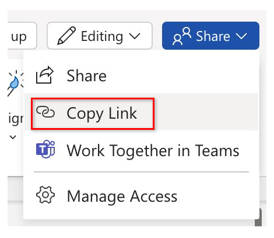

---
task:
    title: 'Task 1: Streamline Data Analysis & Insights with Microsoft 365 Copilot Chat'
---

# Task 1: Streamline Data Analysis & Insights with Microsoft 365 Copilot Chat

In this task, you'll use Microsoft 365 Copilot Chat (Copilot Chat) to uncover actionable insights from the Office of Personnel Management's Federal Employee Viewpoint Survey. With the help of Copilot, you’ll identify key agency trends to support informed decision-making and strategic planning.

## Prepare your Document

<div style="background-color: #ffe6e6; padding: 10px; border-left: 5px solid #ff5c5c; margin-top: 15px;"> 
    <strong>Important:</strong> Download the Excel version of the 2023 report by agency
    <a href="https://www.opm.gov/fevs/reports/data-reports/" target="_blank">here</a> 
    or use a more recent version if available.
</div>

1. In **Excel**, open the Federal Employee Viewpoint Survey document you’d like to use for this task.

1. Save the document to OneDrive by selecting **File** > **Save a Copy** > **OneDrive** > **Save**.

1. Copy the URL of the document by selecting the **Share** button in the upper-right corner above the ribbon and selecting **Copy Link** from the drop-down menu that appears.

    
    
<div style="background-color: #e0f7ff; padding: 10px; border-left: 5px solid #0078D4;"> <strong>Tip:</strong> Save the link to Notepad or use the input box below for quick access during the task. </div>
<label for="inputBox" style="font-weight: bold;">Enter and copy your URL here:</label>
<input type="text" id="inputBox" placeholder="Type something..." style="margin-left: 10px; width: 300px;" />
<button onclick="copyText()" style="margin-left: 10px; padding: 5px 10px; background-color: #0078D4; color: white; border: none; border-radius: 4px; cursor: pointer;">
    Copy
</button>
<p id="statusMessage" style="margin-top: 10px; color: #0078D4;"></p>

<script>
    function copyText() {
        const textBox = document.getElementById("inputBox");
        textBox.select();
        textBox.setSelectionRange(0, 99999); // For mobile devices
        navigator.clipboard.writeText(textBox.value)
            .then(() => {
                document.getElementById("statusMessage").innerText = "Text copied to clipboard!";
            })
            .catch(err => {
                document.getElementById("statusMessage").innerText = "Failed to copy text.";
            });
    }
</script>

## Steps

1. Launch **Copilot Chat** by opening a new Microsoft Edge browser tab and navigate to <a href="https://m365copilot.com" target="_blank">m365copilot.com</a>.

1. Log in to your work account if prompted.

1. With **Copilot Chat** open, ensure that the **Work tab** is selected:

    

1. Explore one or more of the prompting techniques below to help guide your research in Copilot Chat:

    - Single-Shot Prompting
    - Role Prompting (Persona-based Prompting)
    - Chain of Thought Prompting

1. Once you have finished analyzing your survey results, save Copilot's responses to the Word file you created earlier, titled **Copilot Research.docx**, for use in the next task.

## Choose Your Prompting Technique

Each prompting technique below offers unique benefits depending on the depth of analysis you need. Choose the one that best aligns with your objectives:

- **Single-Shot Prompting** is ideal for a quick overview or broad insights.
- **Role Prompting** adds a personal and professional perspective, helping you analyze data from a specific role's viewpoint.
- **Chain of Thought Prompting** enables a deeper exploration of complex issues through a logical series of connected prompts.

### Single-Shot Prompting

Single-shot prompting uses a single, well-crafted prompt to get a comprehensive response from the AI, ideal when you need a quick summary or broad perspective.

Prompt example:

```text
Identify and summarize the top three areas where employees feel most supported and engaged based on the survey results from [Paste link to Federal Employee Viewpoint Survey results]. Highlight any unique strengths that the [agency, e.g., Department of Justice (DOJ)] could build on.
```

<div style="background-color: #e0f7ff; padding: 10px; border-left: 5px solid #0078D4; margin-top: 15px; margin-bottom: 15px;"> 
    <strong>Tip:</strong> Replace bracketed text with your specific agency, for example: "DOJ".
</div>

<div style="background-color: #e0f7ff; padding: 10px; border-left: 5px solid #0078D4; margin-top: 15px; margin-bottom: 15px;">
    <strong>Note:</strong> Be sure to copy Copilot's responses into the Word file you created earlier, titled <strong>Copilot Research.docx</strong>, so you can use them in the next task.
</div>

### Role Prompting (Persona-Based Prompting)

Role prompting lets the AI take on a specific role, such as a senior manager focused on employee wellbeing, to provide tailored insights.

Example prompt:

```text
You are a senior manager responsible for [employee wellbeing]. Using data from [paste link to Federal Employee Viewpoint Survey], identify key strengths within your focus area where the [agency] scores are above other agencies. Then, propose specific actions or initiatives that could help reinforce these positive outcomes and support the [agency] values.
```

<div style="background-color: #e0f7ff; padding: 10px; border-left: 5px solid #0078D4; margin-top: 15px; margin-bottom: 15px;"> 
    <strong>Tip:</strong> Replace bracketed text with your specific agency, for example: "DOJ".
</div>

<div style="background-color: #e0f7ff; padding: 10px; border-left: 5px solid #0078D4; margin-top: 15px; margin-bottom: 15px;">
    <strong>Note:</strong> Be sure to copy Copilot's responses into the Word file you created earlier, titled 
    <strong>Copilot Research.docx</strong>, so you can use them in the next task.
</div>

### Chain of Thought Prompting

Chain of Thought (CoT) prompting breaks down complex issues into a sequence of steps, enabling detailed analysis through a logical sequence.

Example Steps:

- **Prompt 1:**

    ```text
   Based on the Federal Employee Viewpoint Survey results, [paste link to Federal Employee Viewpoint Survey], what are the primary factors contributing to high employee engagement and satisfaction within the [agency]? Highlight any patterns that stand out as strengths.

    ```

- **Prompt 2:**

    ```text
    Considering these engagement strengths, can you suggest strategies or initiatives that could reinforce and build upon these areas, supporting sustained engagement?
    ```

- **Prompt 3:**

    ```text
    Finally, given these strategies, how could the [agency] track continued success in engagement? Identify specific metrics or indicators that would demonstrate progress and recognize ongoing positive outcomes based on future survey results.
    ```
    
<div style="background-color: #e0f7ff; padding: 10px; border-left: 5px solid #0078D4; margin-top: 15px; margin-bottom: 15px;"> 
    <strong>Tip:</strong> Replace bracketed text with your specific agency, for example: "DOJ".
</div>

<div style="background-color: #e0f7ff; padding: 10px; border-left: 5px solid #0078D4; margin-top: 15px; margin-bottom: 15px;">
    <strong>Note:</strong> Be sure to copy Copilot's responses into the Word file you created earlier, titled <strong>Copilot Research.docx</strong>, so you can use them in the next task.
</div>


**Next**: [Task 2](https://microsoftlearning.github.io/Microsoft-Copilot-Immersion-Experience-GOV/Instructions/Labs/Gov_Licensed/Task_2.html)

[Back to Index](https://microsoftlearning.github.io/Microsoft-Copilot-Immersion-Experience-GOV/Instructions/Labs/Gov_Licensed/index_1.html)
