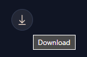

---
task:
    title: 'Task 2: Build a compelling brand using Microsoft Copilot'
---

# Task 2: Build a compelling brand using Microsoft Copilot

Using Copilot, create core branding elements by designing a logo and a catchy slogan that embody the essence of your app or service.

<div style="background-color: #e0f7ff; padding: 10px; border-left: 5px solid #0078D4; margin-top: 15px; margin-bottom: 15px;">
    <strong>Note:</strong> In the instructions below, we will provide a sample prompt for each step. While you have the option to copy and paste these prompts, we encourage you to personalize them in your own style. Be creative and experiment. If Copilot doesn't give you the desired output initially, refine your prompt and try again. Remember to enjoy the process!
</div>

## Steps

- **Create a Logo**:

    1. In **Microsoft Copilot**, copy and paste the sample prompt into the prompt field:

        ```
        Create a simple and modern logo for an [app or service] named [App/Service Name] that targets [target audience/industry]. The logo should convey [desired qualities, e.g., innovation, reliability].
        ```

        <div style="background-color: #e0f7ff; padding: 10px; border-left: 5px solid #0078D4; margin-top: 15px; margin-bottom: 15px;">
            <strong>Note:</strong> Replace the text within brackets with your specific choice (e.g., replace `[App/Service Name]` with `ContosoFit` and `[target audience/industry]` with `fitness enthusiasts/health and wellness`).
        </div>


    1. Optionally, you can download the image created by selecting the download icon to the right of the generated image.

        


- **Generate a Marketing Slogan**:

    With your app or service name and logo in mind, use the following prompt to generate a marketing slogan:

    ```
    Generate a catchy marketing slogan for [App/Service Name] that highlights its unique value proposition and appeals to [target audience].
    ```

    <div style="background-color: #e0f7ff; padding: 10px; border-left: 5px solid #0078D4; margin-top: 15px; margin-bottom: 15px;">
        <strong>Note:</strong> Replace the text within brackets with your specific choice.
    </div>

### Key takeaways

- You discovered how Copilot can generate images based on the context of your conversation.
- You explored how to use Microsoft Copilot to efficiently create various creative outputs.

**Next**: [Task 3](https://microsoftlearning.github.io/Microsoft-Copilot-Immersion-Experience-GOV/Instructions/Labs/Gov_Unlicensed/Task_3.html)

[Back to Index](https://microsoftlearning.github.io/Microsoft-Copilot-Immersion-Experience-GOV/Instructions/Labs/Gov_Unlicensed/index_1.html)